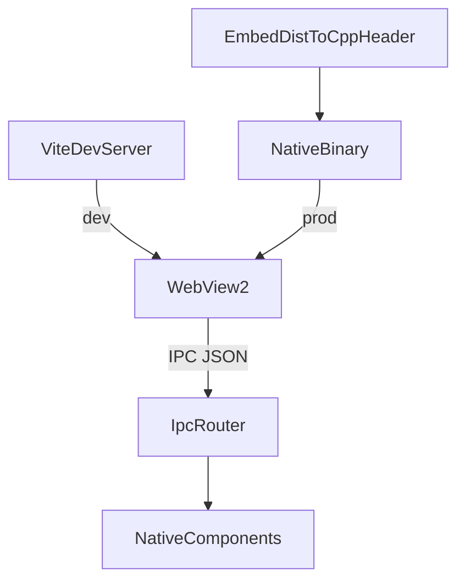

# Shine

---

### ! IMPORTANT: Windows only now. WIP

---

Build compact, high-performance, and secure desktop applications using a web frontend — powered by modern C++20.

Shine is **inspired by [Tauri](https://tauri.app/)**: you build your UI with modern web tooling (Vite/React/etc.), while the native side stays lightweight, secure, and focused on OS integration.

## What’s inside

- **`core/`**: the Shine runtime (window + WebView + IPC router)
- **`components/`**: optional native components (example: filesystem)
- **`create-shine-app/`**: project scaffolding tool (`npx create-shine-app@latest`)

## Quick start (recommended)

Create a new app:

```bash
npx create-shine-app@latest
```

Then:

```bash
cd my-shine-app
npm install
```

### Dev mode (Vite)

Run the frontend dev server:

```bash
npm run dev
```

Build & run the native target from your IDE (CLion / Visual Studio) or via CMake.

In **Debug**, Shine navigates to `http://localhost:5173`.

### Production build (in-memory assets)

Build everything (frontend + native):

```bash
npm run build
```

In **Release**, Shine loads your UI from `http://shine.app/*` and serves `index.html`, JS, CSS, images **directly from bytes embedded into the native binary** (no runtime unpacking to disk).

## How it works (Tauri-like flow)



- **Dev**: web assets are served by Vite.
- **Prod**: web assets are compiled into a generated C++ header and served from memory by the WebView resource interceptor.
- **IPC**: the frontend calls `window.chrome.webview.postMessage(...)`; the native side routes commands via an allowlist (`shine.conf.json`).

## Scaffolding: `create-shine-app`

The generator creates:

- `frontend/` (Vite + React)
- `shine/` (vendored Shine sources)
- a native CMake target linked against `shine_core` and `shine_components`
- npm scripts for build orchestration

## Status

This project is under active development. APIs and project layout may change.
